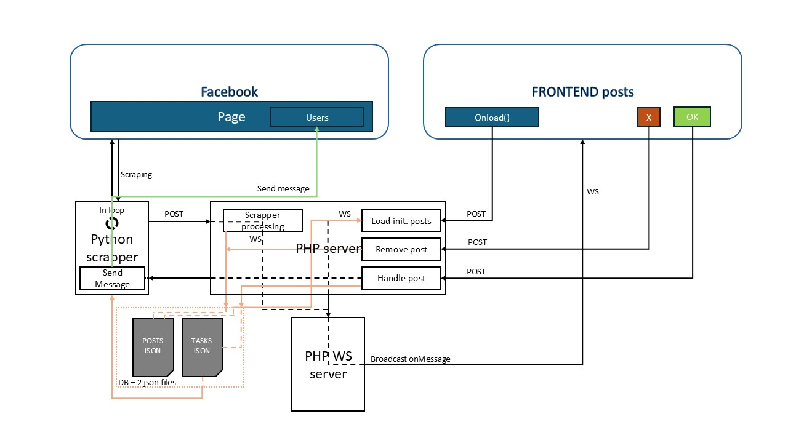

# Facebook automation
## description
* This code scrapes a specific facebook group and download all the posts with Selenium (as Facebook just disable GROUP API)(running in loop approximately every 15 minutes with normal distribution)
* The posts are filtered to get only revelant ones (PHP server to save into posts.json)
* The filtered posts are displayed on front-end (send via Websocket)
* Upon user interaction, a post is either discarted or it is processed (POST to PHP server to save into tasks.json)
* The processing means to write a private message to the user of the post via Selenium (Python script running in loop checking Tasks.json)

## Architecture

## How to run
* run php server
> php -S 0.0.0.0:8000
* run php websocket server
> php websocket-server.php
* open index.html
> http://localhost:8000/index.html

## note
* login info stored in the file **.env**
* running with Selenium
* php rotchet for websocket
